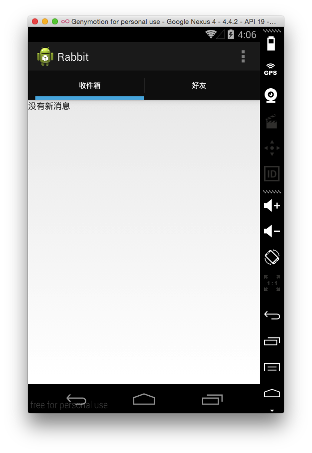

title:使用Android开发一个阅后即焚－03 在tab中使用fragment
date:2014-10-15 23:06
category:Android
tags:Android
author:刘理想
summary:在tab中使用fragment

##1. 为什么使用fragment?

简而言之，fragment可以让我们复用设计和代码。

##2. fragment如何作为tab使用

- 在Activity里创建一个fragment container
- 创建fragment对应的class和layout
- 在Activity中添加初始化的fragment。当Activity加载时，初始化的fragment也应该加载
- 添加tab到Action Bar。Action Bar用来控制和显示tab
- 添加`TabListener`来加载新的fragment

可以在layout中使用fragment元素来显示的包含fragment。

##3. 从模板中修改tab

tab中的fragment到底是在哪里定义的呢？我们打开MainActivity，看到文件最后，定义了静态类：

```java
public static class PlaceholderFragment extends Fragment {
    /**
     * The fragment argument representing the section number for this
     * fragment.
     */
    private static final String ARG_SECTION_NUMBER = "section_number";

    /**
     * Returns a new instance of this fragment for the given section
     * number.
     */
    public static PlaceholderFragment newInstance(int sectionNumber) {
        PlaceholderFragment fragment = new PlaceholderFragment();
        Bundle args = new Bundle();
        args.putInt(ARG_SECTION_NUMBER, sectionNumber);
        fragment.setArguments(args);
        return fragment;
    }

    public PlaceholderFragment() {
    }

    @Override
    public View onCreateView(LayoutInflater inflater, ViewGroup container,
            Bundle savedInstanceState) {
        View rootView = inflater.inflate(R.layout.fragment_main, container, false);
        return rootView;
    }
}
```

现在先不对这个类做太多深入了解，我们往上看，会看到一个`SectionsPagerAdapter`类的定义，这个类用可以看作是mvc中的控制器，用来连接视图和模型，其中视图就是屏幕，模型就是Fragment。

我们把它抽出来存放到一个单独的类中：

```java
public class SectionsPagerAdapter extends FragmentPagerAdapter {

    private Context mContext;

    public SectionsPagerAdapter(Context context, FragmentManager fm) {
        super(fm);
        mContext = context;
    }

    @Override
    public Fragment getItem(int position) {
        // getItem is called to instantiate the fragment for the given page.
        // Return a PlaceholderFragment (defined as a static inner class below).
        return MainActivity.PlaceholderFragment.newInstance(position + 1);
    }

    @Override
    public int getCount() {
        // Show 2 total pages.
        return 2;
    }

    @Override
    public CharSequence getPageTitle(int position) {
        Locale l = Locale.getDefault();
        switch (position) {
            case 0:
                return mContext.getString(R.string.title_section1).toUpperCase(l);
            case 1:
                return mContext.getString(R.string.title_section2).toUpperCase(l);
        }
        return null;
    }
}
```

注意，因为`getString`是`Context`类的方法。因此，我们需要传进来`Context`，而`Activity`类是`Context`的子类，所以调用时将`Activity`传给它即可。

```java
// Create the adapter that will return a fragment for each of the three
// primary sections of the activity.
mSectionsPagerAdapter = new SectionsPagerAdapter(this, getFragmentManager());
```

另外，更改数量为2，两个的标题分别为“收件箱”和“好友”。

##4. 从模板中修改fragment

现在我们已经有了所有的一切，除了fragement，目前用来的还是默认的fragment。我们要做的就是把它给替换掉。

###4.1 添加`InboxFragment`

新建一个类，类名是`InboxFragment`, 这个类继承自，继承自`android.app.ListFragment`(也可以继承自`android.support.v4.app.ListFragment`，这样Android4.0之前的版本也能够使用）。
这里需要说明的是因为我们创建的是List类型的视图，所以创建了ListFragment，如同ListActivity对应Activity一样，ListFragment也对应继承自Fragment。

打开MainActivity，复制其中的PlaceHolderFragment的`onCreateView`方法到`InboxFragment`之中。Fragment像Activity一样也有`onCreate`方法，但是这里我们关注的是`onCreateView`方法，该方法在对应的Layout画面渲染时调用。修改后的类如下所示，同时，删除MainActivity中对应的PlaceHolderFragment。

```java
public class InboxFragment extends ListFragment {

    @Override
    public View onCreateView(LayoutInflater inflater, ViewGroup container,
                             Bundle savedInstanceState) {
        View rootView = inflater.inflate(R.layout.fragment_main, container, false);
        return rootView;
    }
}
```

上面的例子中`inflater.inflate(R.layout.fragment_main, container, false)`可以当作Activity中的`setContentView`方法，其中第一个参数就是layout，第二个参数是MainActivity中的`ViewPage`，第三个参数始终是`false`。

###4.2 修改InboxFragment对应的layout

首先，重构`fragment_main.xml`为`fragment_inbox.xml`.

然后，修改`fragment_inbox`的内容：

```
<RelativeLayout xmlns:android="http://schemas.android.com/apk/res/android"
    xmlns:tools="http://schemas.android.com/tools"
    android:layout_width="match_parent"
    android:layout_height="match_parent"
    tools:context="io.github.liulixiang1988.rabbit.InboxFragment">


    <ListView
        android:layout_width="match_parent"
        android:layout_height="match_parent"
        android:id="@android:id/list"
        android:layout_alignParentTop="true"
        android:layout_alignParentLeft="true"
        android:layout_alignParentStart="true" />

    <TextView
        android:id="@android:id/empty"
        android:layout_width="match_parent"
        android:layout_height="wrap_content"
        android:text="@string/empty_inbox_label"/>
</RelativeLayout>

```
我们在这里做了一个列表，并且列表为空时显示“没有新消息”（在empty_inbox_label中定义）。

###4.3 添加好友列表

类似的，添加`FriendsFragment`,`fragment_friends.xml`等，然后修改SectionPagerAdapter`。

###4.4 修改`SectionsPagerAdapter`

```
public Fragment getItem(int position) {
    switch (position){
        case 0 :
            return new InboxFragment();
        case 1:
            return new FriendsFragment();
    }
    return null;
}
```

最后，运行如下：



##5 理解基于Fragment的代码的其他部分

我们知道，创建一个Fragment程序分为以下几步：

1. 在Activity中创建一个Fragment的容器（创建`SectionsPagerAdapter`，并且在`MainActivity`中添加了`SectionsPagerAdapter`实例）
2. 创建Fragment的类和布局（创建`FriendsFragment`和`InboxFragment`和对应的xml）
3. 在Activity中初始化Fragment（在`SectionsPagerAdapter`中的`getItem`中创建）
4. 在Action Bar中添加tab
5. 添加TabListener来加载新的Fragment

我们已经做了步骤1、2、3，现在我们打开`MainActivity`来看看它的`onCreate`方法：

```
protected void onCreate(Bundle savedInstanceState) {
    //...

    // 设置Action Bar
    final ActionBar actionBar = getActionBar();
    actionBar.setNavigationMode(ActionBar.NAVIGATION_MODE_TABS);

    // 设置返回fragment的adapter
    mSectionsPagerAdapter = new SectionsPagerAdapter(this, getFragmentManager());

    // 设置ViewPager
    mViewPager = (ViewPager) findViewById(R.id.pager);
    mViewPager.setAdapter(mSectionsPagerAdapter);

    //在不同的区域滑动时，选择对应的tab，并且使用对应的ActionBar.Tab#select()来完成这些
    mViewPager.setOnPageChangeListener(new ViewPager.SimpleOnPageChangeListener() {
        @Override
        public void onPageSelected(int position) {
            actionBar.setSelectedNavigationItem(position);
        }
    });

    // 对每一节，添加tab到action bar
    for (int i = 0; i < mSectionsPagerAdapter.getCount(); i++) {
        // Create a tab with text corresponding to the page title defined by
        // the adapter. Also specify this Activity object, which implements
        // the TabListener interface, as the callback (listener) for when
        // this tab is selected.
        actionBar.addTab(
                actionBar.newTab()
                        .setText(mSectionsPagerAdapter.getPageTitle(i))
                        .setTabListener(this));
    }
}

```