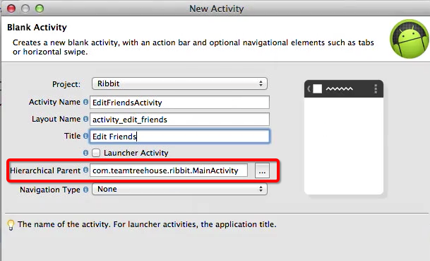

title:使用Android开发一个阅后即焚－04 Parse中用户相关的知识
date:2014-11-30 18:12
category:Android
tags:Android
author:刘理想
summary:04 Parse中用户相关的知识

##1 添加好友编辑页面
我们需要添加一个编辑好友的界面，但是，首先我们需要做添加一个菜单选项来跳转到好友编辑页面。

###1.1 添加好友编辑菜单
打开`res\menu\main.xml`，添加菜单

```
<item android:id="@+id/action_edit_friends"
    android:title="@string/menu_edit_friends_label"/>
```

打开MainActivity，添加菜单响应事件

```
public boolean onOptionsItemSelected(MenuItem item) {
    // Handle action bar item clicks here. The action bar will
    // automatically handle clicks on the Home/Up button, so long
    // as you specify a parent activity in AndroidManifest.xml.
    int id = item.getItemId();
    if (id == R.id.action_logout) {
        //登出
        ParseUser.logOut();
        navigateToLoginScreen();
        return true;
    }
    if (id == R.id.action_edit_friends){
        Intent i = new Intent(this, EditFriendsActivity.class);
        startActivity(i);
    }
    return super.onOptionsItemSelected(item);
}
```

现在EditFriendsActivity还没有创建，下一步我们将创建这个类。

###1.2 创建EditFriendsActivity

添加EditFriendsActivity如下


注意，划线部分表示整个解构树.

###1.3 修改EditFriendsActivity对应的XML

```
<RelativeLayout xmlns:android="http://schemas.android.com/apk/res/android"
    xmlns:tools="http://schemas.android.com/tools"
    android:layout_width="match_parent"
    android:layout_height="match_parent"
    tools:context="io.github.liulixiang1988.rabbit.EditFriendsActivity">

    <ListView
        android:layout_width="match_parent"
        android:layout_height="match_parent"
        android:id="@android:id/list"
        android:layout_alignParentTop="true"
        android:layout_alignParentLeft="true"
        android:layout_alignParentStart="true" />
</RelativeLayout>
```

###1.4 设置EditFriendsActivity为垂直的

打开`AndroidManifest.xml`，修改
```
<activity
    android:name="io.github.liulixiang1988.rabbit.EditFriendsActivity"
    android:label="@string/title_activity_edit_friends"
    android:screenOrientation="portrait"
    android:parentActivityName="io.github.liulixiang1988.rabbit.MainActivity" >
    <meta-data
        android:name="android.support.PARENT_ACTIVITY"
        android:value="io.github.liulixiang1988.rabbit.MainActivity" />
</activity>
```

##2 添加用户查询

添加用户查询，为了能够使每次进入好友编辑页面时更新前1000位用户，我们在`EditFriendsActivity.onResume`中添加查询

```
public class EditFriendsActivity extends Activity {
    @Override
    protected void onResume() {
        super.onResume();
        ParseQuery<ParseUser> query = ParseUser.getQuery();
        query.orderByAscending(ParseConstant.KEY_USERNAME);
        query.setLimit(1000);
    }
}
```
为了防止我们出现打错字符，我们定义了一个`ParseConstant`类：

```
public final class ParseConstant {
    public static final String KEY_USERNAME="username";
}
```


##3 执行查询

##4 从列表中选择好友

##5 保存好友关系

##6 List加载完毕后添加对号

##7 显示好友列表

##8 移除好友关系